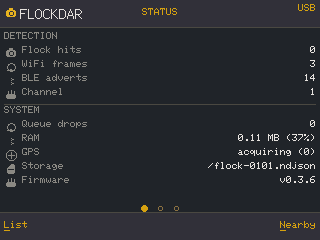
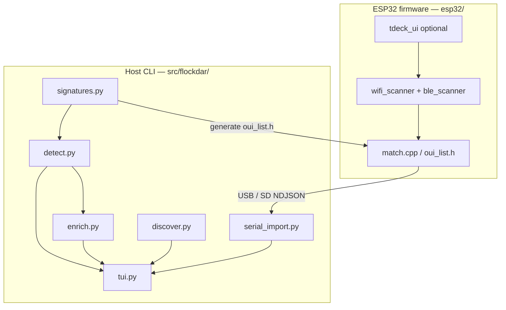
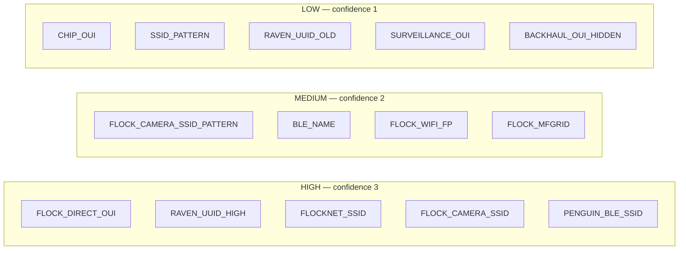

# flockdar

[](https://pypi.org/project/flockdar/)

Passive RF detection of Flock Safety ALPR (automatic license plate reader) cameras from [WiGLE](https://wigle.net) wardriving data and from **live ESP32 scanners**.

---

## Two components

| | **Host CLI** (Python) | **ESP32 firmware** |
|---|---|---|
| **What** | Analyse WiGLE exports, enrich hits, interactive TUI | Real-time WiFi/BLE scanner with optional on-device UI |
| **Where** | `src/flockdar/` · [`flockdar` on PyPI](https://pypi.org/project/flockdar/) | `esp32/` · [PlatformIO](https://platformio.org/) |
| **Runs on** | Your laptop (macOS, Linux, Windows) | LilyGO **T-Deck** (recommended) or generic ESP32-S3 |
| **Needs hardware?** | No (WiGLE file alone is enough) | Yes, to transmit live; SD logs can be replayed in the CLI later |
| **Main commands** | `flockdar`, `flockdar-ingest` | `pio run -e t-deck -t upload` |

The CLI and firmware share the same signature lists in `signatures.py` / `oui_list.h`. USB serial and SD-card NDJSON use the same `Hit` pipeline as WiGLE SQLite/CSV.

**Full docs hub:** [**docs/README.md**](docs/README.md) · per-OS setup: [**SETUP.md**](SETUP.md)



---

## Quick start

### Host CLI

Works with **no ESP32** — only a WiGLE backup or export.

```bash
pip install flockdar && flockdar wigle_backup.sqlite
```

From source ([SETUP.md](SETUP.md)):

```bash
git clone https://github.com/thehappydinoa/flockdar
cd flockdar && uv sync
uv run flockdar wigle_backup.sqlite
uv run flockdar WigleWifi_export.csv.gz
```

| Input | Example |
|-------|---------|
| WiGLE SQLite (best) | `uv run flockdar wigle_backup.sqlite` |
| WiGLE CSV | `uv run flockdar WigleWifi_export.csv.gz` |
| Live serial (firmware) | `uv run flockdar --serial COM4` |
| SD log replay | `uv run flockdar flock-0001.ndjson` |

### ESP32 firmware

Build and flash first, then open the CLI on serial (or copy the `.ndjson` log off the card).

```bash
uv run esp32/gen_oui_header.py
cd esp32 && pio run -e t-deck -t upload
uv run flockdar --serial COM4
```

Board-specific steps: [**esp32/BOARDS.md**](esp32/BOARDS.md). Protocol and pins: [**esp32/README.md**](esp32/README.md).

---

## What it detects

| Device | RF signature | Confidence |
|---|---|---|
| Flock camera WiFi | SSID `Flock-XXXXXX` where XXXXXX matches last 6 of MAC | High |
| Flock camera backhaul | WiFi SSID `flocknet` on eero hardware (`80:da:13`) | High |
| Flock Safety hardware | MAC prefix `b4:1e:52` (direct IEEE registration) | High |
| Raven firmware (1.2+) | Custom BLE services `0x3100`–`0x3500` | High |
| Penguin surveillance | BLE name `Penguin-XXXXXXXXXX` (10-digit numeric) | High |
| Penguin surveillance | BLE manufacturer ID 2504 | Medium |
| Any Flock camera | OUI + WPA2-no-WPS + 2.4 GHz channel 1/6/11 | Medium |
| FS Ext Battery | BLE name `FS Ext Battery` | Medium |
| Raven firmware (1.1.7) | BLE services `0x1809` / `0x1819` | Low–Medium |
| Flock-family hardware | Chip-vendor OUI match (38 prefixes) | Low |
| Other surveillance | Axis, FLIR, Hanwha, Avigilon, etc. OUIs | Informational |

---

## TUI keybindings

| Key | Action |
|-----|--------|
| `↑` / `↓` | Navigate device list |
| `m` | Open selected location in Google Maps |
| `v` | Open in Google Street View |
| `c` | Copy MAC address(es) to clipboard |
| `n` | Enrich visible hits (OSM/DeFlock, ALPRWatch, WiGLE) |
| `w` | Configure WiGLE API credentials |
| `e` | Export visible hits to CSV |
| `k` | Export visible hits to KML |
| `g` | Export visible hits to GeoJSON |
| `o` | Open iD editor + copy OSM tags for selected camera |
| `r` | Reload / re-scan file |
| `q` | Quit |

The left sidebar has **Confidence** and **Type** filters and a **Group nearby** checkbox that collapses devices within 75 m of each other into a single cluster row.

---

## Enrichment

Press `n` to cross-reference all visible hits against external databases. Results appear live in the **Enriched** table column and the detail panel.

| Source | Signal | Auth |
|---|---|---|
| DeFlock / OpenStreetMap | `OSM_ALPR_NEARBY` — confirmed ALPR node within 150 m | None |
| ALPRWatch | `ALPRWATCH_NEARBY` — daily KMZ, cached 24 h | None |
| WiGLE API | `WIGLE_SEEN` — first/last seen dates, sighting count | API key |

**WiGLE credentials** — press `w` in the TUI, or set environment variables:

```bash
export WIGLE_API_NAME=your_api_name
export WIGLE_API_TOKEN=your_api_token
uv run flockdar wigle_backup.sqlite
```

Credentials are stored in `~/.config/flockdar/config.json` (Unix: `chmod 600`).

---

## Getting your WiGLE data

**SQLite DB (preferred)** — richer data, includes BLE service UUIDs and manufacturer IDs:
Open the WiGLE WiFi Wardriving app → Menu → Backup Database → copy `wigle.sqlite` off the device.

**CSV export** — no BLE service UUID data:
wigle.net → My Account → Downloads, or app → Menu → Export to SD.

---

## Repository layout



| Path | Component |
|------|-----------|
| `src/flockdar/` | Python package — detection, TUI, ingest, enrichment |
| `esp32/` | Firmware — scanners, UI, serial protocol |
| `docs/` | Documentation hub and screenshots |
| `tests/` | pytest (CLI + signature parity) |
| `SETUP.md` | Install for Python and PlatformIO on all OSes |

Console scripts: `flockdar` → TUI; `flockdar-ingest` → headless ingest ([`serial_import.py`](src/flockdar/serial_import.py)).

---

## Running tests

```bash
uv run pytest
```

Tests cover `detect.py` signal logic, `enrich.py` enrichers (via `httpx.MockTransport`), `signatures.py` pattern correctness, and `serial_import.py` HMAC verification / NDJSON ingest.

---

## How detection works

`detect.py` runs every record through `signatures.py` and appends `(label, detail)` signal tuples to each `Hit`. Confidence is derived from which labels are present — no stored score:



`Cluster` groups nearby hits (union-find, 75 m radius) and reports the highest confidence across members.

### What WiGLE passive scanning misses

Flock cameras spend most of their duty cycle asleep, waking briefly to upload. A passive WiGLE scan will miss cameras during sleep. The [flock-you](https://github.com/DeflockJoplin/flock-you) and [FlockSquawk](https://github.com/f1yaw4y/FlockSquawk) projects implement **promiscuous 802.11 mode** on ESP32 hardware, matching `addr1` (receiver) as well as `addr2` (transmitter) to catch cameras even while they sleep. Newer Flock firmware also emits **wildcard probe requests** (SSID length = 0) on wake-up — detectable only via raw frame capture.

### Active GATT interrogation

Raven firmware exposes a readable GATT tree without authentication when within BLE range (~10 m). See `signatures.py:RAVEN_CHARACTERISTICS` for the full characteristic map. Key characteristics:

| UUID | Field |
|---|---|
| `0x2a26` | Firmware version (`1.1.7`, `1.2.0`, `1.3.1`) |
| `0x3002` | Serial number |
| `0x3101` / `0x3102` | Camera's own GPS latitude / longitude |
| `0x3303` | LTE operator |
| `0x3402` | Most recent upload time |

---

## Headless / scripted use

```python
from pathlib import Path
import asyncio
from flockdar import run_detection
from flockdar.enrich import build_enrichers, enrich_hits_async

hits, total = run_detection(Path("wigle_backup.sqlite"))
enrichers = build_enrichers()                    # OSM + ALPRWatch; add WiGLE creds if wanted
asyncio.run(enrich_hits_async(hits, enrichers))

for h in hits:
    print(h.confidence_label, h.mac, repr(h.ssid), h.signals_str())
```

---

## Signature sources

Research attribution — cite these projects when reusing signature data:

- **NitekryDPaul** — WiFi OUI list via promiscuous-mode 802.11 analysis ([flock-you dataset](https://github.com/DeflockJoplin/flock-you/blob/main/datasets/NitekryDPaul_wifi_ouis.md))
- **NSM-Barii** — Raven BLE service UUIDs, BLE name patterns, newer firmware probe-request technique ([flock-back](https://github.com/NSM-Barii/flock-back))
- **f1yaw4y** — Combined OUI list, surveillance OUIs, FlockSquawk firmware ([FlockSquawk](https://github.com/f1yaw4y/FlockSquawk))
- **DeFlock / FoggedLens** — OSM ALPR crowdsourcing and enrichment API ([deflock.org](https://deflock.org))
- **ALPRWatch** — ALPR location database ([alprwatch.org](https://alprwatch.org))

---

## Known false positives

| OUI / Pattern | Common non-Flock device | How to distinguish |
|---|---|---|
| `f4:6a:dd` | Barco ClickShare AV gear | SSID contains "ClickShare" |
| `e4:aa:ea` | Cisco CX20 conferencing | SSID is `CX20-N` |
| `14:5a:fc` | Generic BT consumer chips | Named laptop/headphone SSID |
| `74:4c:a1` | Vizio soundbars | SSID starts `VIZIO` |
| `0000180a` UUID | Nearly all BLE devices | Do not use alone |
| eero `80:da:13` (named SSID) | Home/business mesh routers | Only flag blank or `flocknet` SSIDs |

---

## License

MIT — see [LICENSE](LICENSE). Research and educational use. Cite original researchers when reusing signature data.

This tool is for privacy research, transparency advocacy, and understanding the RF footprint of surveillance infrastructure. It does not interact with cameras or any live systems.
