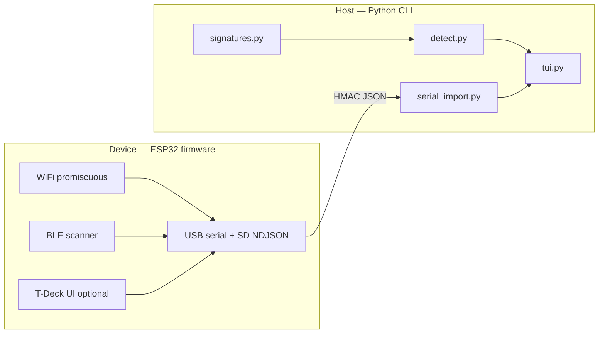

# flockdar documentation

flockdar is two cooperating projects in one repository:

| Component | Location | Role |
|-----------|----------|------|
| **Host CLI** | [`src/flockdar/`](../src/flockdar/) · PyPI [`flockdar`](https://pypi.org/project/flockdar/) | Offline WiGLE analysis, enrichment, Textual TUI |
| **ESP32 firmware** | [`esp32/`](../esp32/) | Passive WiFi + BLE scanner, optional T-Deck UI, signed JSON stream |

They share detection rules: edit [`signatures.py`](../src/flockdar/signatures.py), then run `uv run esp32/gen_oui_header.py` so C and Python stay aligned.



---

## Host CLI

**Use when you have** a WiGLE SQLite/CSV export, an SD-card `flock-NNNN.ndjson` log, or a live USB serial connection to flashed hardware.

| Entry point | Purpose |
|-------------|---------|
| `flockdar` | Interactive TUI — filters, maps, enrichment, export |
| `flockdar-ingest` | Headless serial or log → SQLite (WiGLE-shaped) |

**Install and run** — see [SETUP.md §1](../SETUP.md#1-python-tool-flockdar) and the [root README quick start](../README.md#host-cli).

```bash
uv sync
uv run flockdar wigle_backup.sqlite
uv run flockdar --serial COM4          # live from firmware
uv run flockdar flock-0001.ndjson      # replay SD log
```

**Does not require** ESP32 hardware. All WiGLE-path detection is fully offline.

---

## ESP32 firmware

**Use when you want** real-time wardriving: promiscuous WiFi (sleeping cameras as `addr1`), BLE signatures, GPS tags, on-device hit list, and microSD logging.


*Status carousel (T-Deck / T-Deck Plus, `env:t-deck`). Shows detection counters, GPS, SD log path, and firmware version.*

| Topic | Doc |
|-------|-----|
| Per-board build & flash | [esp32/BOARDS.md](../esp32/BOARDS.md) |
| Serial protocol, HMAC, hardware | [esp32/README.md](../esp32/README.md) |
| Toolchain (PlatformIO, drivers) | [SETUP.md §2–5](../SETUP.md) |
| Long-run soak test | [esp32/SOAK.md](../esp32/SOAK.md) |

**Typical flow:**

```bash
uv run esp32/gen_oui_header.py
cd esp32 && pio run -e t-deck -t upload
uv run flockdar --serial COM4
```

**Capture UI screenshots** (for docs or debugging):

```bash
uv run python esp32/screenshot.py COM4 --already-running -o out.bmp
# PNG: uv run --extra esp32 python -c "from PIL import Image; Image.open('out.bmp').save('out.png')"
```

---

## How the CLI and firmware connect

1. Firmware emits one JSON object per line (`wifi`, `ble`, `gps`, …) with an HMAC `sig` field.
2. `serial_import.py` verifies signatures and maps lines to the same `Hit` objects as WiGLE analysis.
3. The TUI treats serial and file inputs identically after ingest.

Default baud **115200** on USB CDC. Set matching `FD_HMAC_KEY` in `esp32/platformio.ini` and `$FLOCKDAR_HMAC_KEY` (or `--key`) on the host before field use.

---

## More reading

- [Root README](../README.md) — detection signatures, enrichment, false positives, research credits
- [SETUP.md](../SETUP.md) — macOS / Linux / Windows install for both stacks
- [CLAUDE.md](../CLAUDE.md) — module layout for contributors and AI assistants
