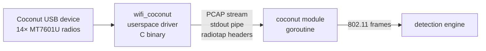

# ADR-0013: WiFi Coconut userspace driver integration

**Status:** Accepted  
**Date:** 2026-06-04

## Context

ADR-0005 and earlier architecture docs assumed the WiFi Coconut presents as 14 standard `wlan*` kernel interfaces readable via `gopacket/pcap.OpenLive()`. This is **incorrect**.

The Coconut uses a **userspace C driver** (`hak5-wifi-coconut`) — a port of the Linux kernel MT76 drivers rewritten to run as a normal process with direct USB access. It does not create kernel network interfaces. Instead, it multiplexes all 14 radios and outputs a single merged **PCAP stream to stdout**, with radiotap headers added in userspace.

This was discovered by reviewing the [hak5/hak5-wifi-coconut](https://github.com/hak5/hak5-wifi-coconut) repository and Hak5's documentation.

## Decision

The daemon's Coconut module launches `wifi_coconut` as a subprocess and reads its PCAP stdout stream using `gopacket/pcapgo` — no libpcap live capture, no kernel interfaces.

## Architecture



## Implementation

```go
// internal/modules/coconut/coconut.go

func (m *CoconutModule) Run(ctx context.Context, ch chan<- protocol.Detection) error {
    cmd := exec.CommandContext(ctx, "wifi_coconut", "-")  // "-" = stdout PCAP
    stdout, err := cmd.StdoutPipe()
    if err != nil { return err }
    if err := cmd.Start(); err != nil { return err }

    reader, err := pcapgo.NewReader(stdout)
    if err != nil { return err }

    for {
        data, ci, err := reader.ReadPacketData()
        if err != nil {
            if errors.Is(err, io.EOF) { return nil }
            return err
        }
        packet := gopacket.NewPacket(data, layers.LayerTypeRadioTap, gopacket.Default)
        if det := parseFrame(packet, ci); det != nil {
            select {
            case ch <- *det:
            case <-ctx.Done():
                return ctx.Err()
            }
        }
    }
}
```

Key points:
- `wifi_coconut -` pipes merged PCAP from all 14 radios to stdout, one channel per radio cycling
- `pcapgo.NewReader` reads PCAP without libpcap dependency
- Radiotap headers carry channel/frequency/RSSI per packet — parsed to populate `Detection.Channel` and `Detection.RSSI`
- Subprocess is killed cleanly when context is cancelled

## Kismet as an alternative

Kismet has native Coconut support (`--enable-wifi-coconut` build flag) and exposes packets via its REST API or PCAP-over-IP. This is heavier (Kismet is a full framework) but useful if you want Kismet's additional analysis alongside flockdar. The two are **not mutually exclusive** — you can run Kismet on port 2501 and flockdar on port 8080 from the same Coconut.

For flockdar's purposes, the direct `wifi_coconut` subprocess approach is preferred: no extra dependency, lower overhead, faster startup.

## Prerequisites on Pi

```bash
# Install hak5-wifi-coconut (Kali/Debian package available)
sudo apt install hak5-wifi-coconut
# OR build from source:
git clone https://github.com/hak5/hak5-wifi-coconut && cd hak5-wifi-coconut
mkdir build && cd build && cmake .. && make && sudo make install

# Verify
wifi_coconut --list-devices   # should show 14 USB devices
```

The `wifi_coconut` binary requires root (or `CAP_NET_RAW` + USB device permissions). The daemon's systemd unit already requests `AmbientCapabilities=CAP_NET_RAW CAP_NET_ADMIN`.

## USB device permissions (non-root option)

```bash
# Create udev rule for Coconut USB devices (MT7601U VID:PID = 148f:7601)
echo 'SUBSYSTEM=="usb", ATTR{idVendor}=="148f", ATTR{idProduct}=="7601", MODE="0664", GROUP="flockdar"' \
  | sudo tee /etc/udev/rules.d/99-coconut.rules
sudo udevadm control --reload
```

## Corrected architecture in ADR-0005

ADR-0005 stated the Coconut module "auto-detects 14 interfaces by USB VID/PID, spins up one goroutine per interface." The corrected description:

> The Coconut module launches `wifi_coconut` as a subprocess and reads a single merged PCAP stream from its stdout. One goroutine handles the stream. All 14 channels are already multiplexed by the userspace driver — no per-interface goroutines needed.

## Taskfile additions

```yaml
coconut:install:
  desc: "Build and install hak5-wifi-coconut userspace driver"
  cmds:
    - git clone https://github.com/hak5/hak5-wifi-coconut /tmp/coconut
    - cmake -S /tmp/coconut -B /tmp/coconut/build
    - cmake --build /tmp/coconut/build
    - sudo cmake --install /tmp/coconut/build
    - rm -rf /tmp/coconut

coconut:test:
  desc: "Verify Coconut is detected and producing packets"
  cmds:
    - wifi_coconut --list-devices
    - timeout 5 wifi_coconut - | tcpdump -r - -c 5 2>/dev/null || true
```

## Consequences

- Coconut module is simpler than expected: one subprocess + one goroutine, not 14
- `gopacket/pcapgo` used instead of `gopacket/pcap` for Coconut (no libpcap dependency for this path)
- `wifi_coconut` binary must be installed on the Pi separately (added to setup guide and `task coconut:install`)
- The daemon auto-detects Coconut availability at startup: if `wifi_coconut --list-devices` exits 0, enable the module
- libpcap (`gopacket/pcap`) is still used for the Alfa single-interface monitor mode module

Sources:
- [hak5/hak5-wifi-coconut](https://github.com/hak5/hak5-wifi-coconut)
- [Hak5 WiFi Coconut + Kismet](https://docs.hak5.org/wifi-coconut/capture-files/kismet/)
- [Kali Linux hak5-wifi-coconut package](https://www.kali.org/tools/hak5-wifi-coconut/)
