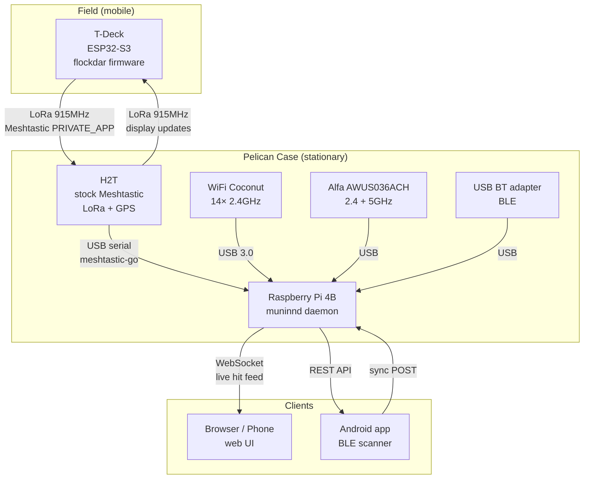
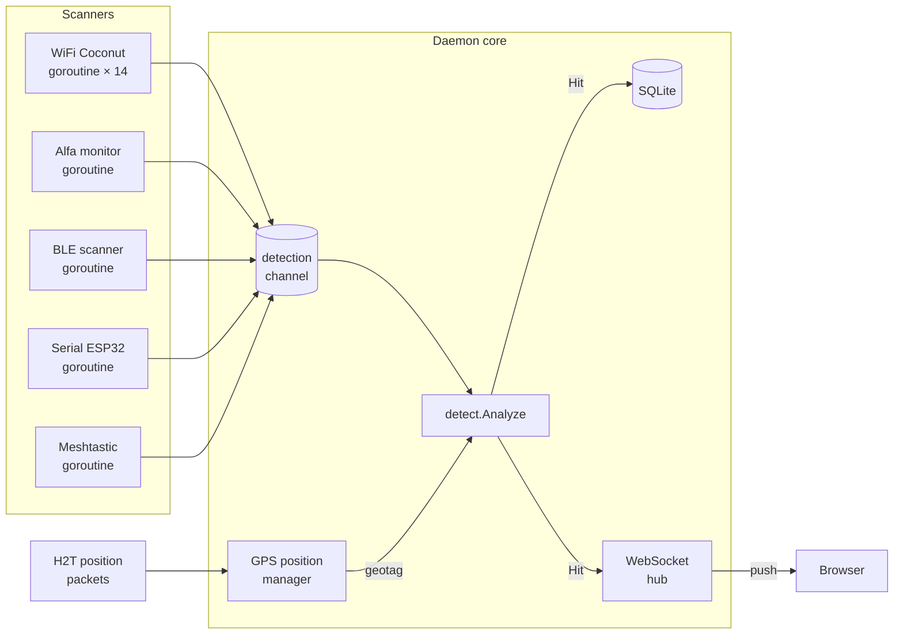
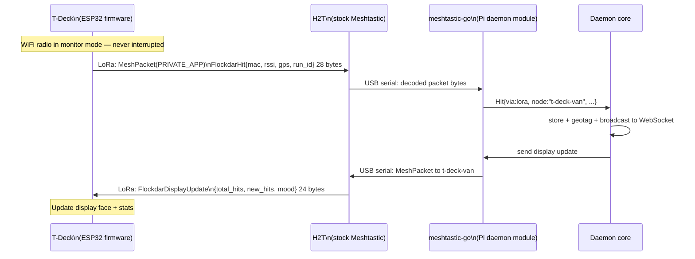
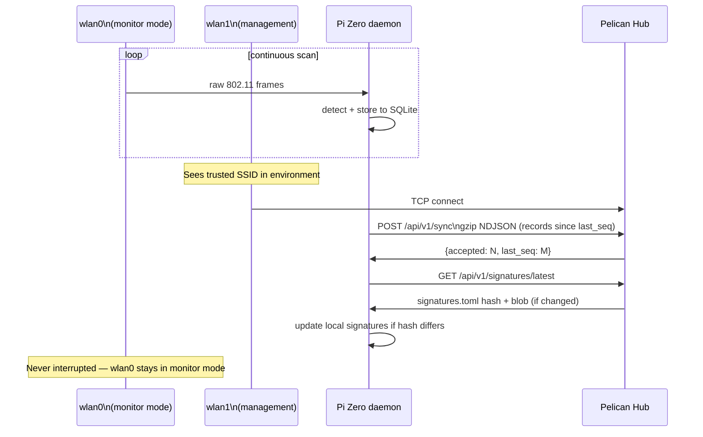
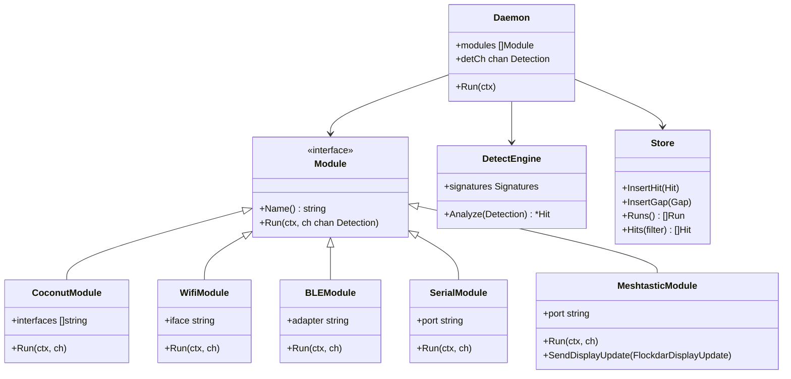
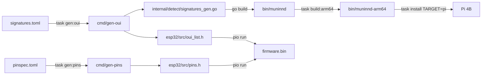

# Architecture

## System overview

## Data flow: detection to display

## T-Deck LoRa communication

## Node sync flow (Pi Zero 2W)

## Module architecture (daemon)

## Repository layout

```mermaid
graph TD
    ROOT["/"]
    CMD[cmd/]
    INT[internal/]
    WEB[web/]
    ESP[esp32/]
    DOCS[docs/]
    SIG[signatures.toml]
    TASK[Taskfile.yml]

    ROOT --> CMD & INT & WEB & ESP & DOCS & SIG & TASK

    CMD --> DAEMOND[muninnd/\ndaemon binary]
    CMD --> DAEMONCLI[muninn/\nCLI binary]
    CMD --> GENOUI[gen-oui/\nOUI header generator]
    CMD --> GENPINS[gen-pins/\npin header generator]

    INT --> DAEMON[daemon/\ncore + module registry]
    INT --> MODULES[modules/\nwifi · ble · serial\nmeshtastic · coconut]
    INT --> DETECT[detect/\nengine + signatures_gen.go]
    INT --> PROTOCOL[protocol/\nNDJSON types · HMAC]
    INT --> STORE[store/\nSQLite backend]
    INT --> API[api/\nREST + WebSocket]
    INT --> RUNS[runs/\nrun tracking · GPS trace]
    INT --> SYNC[sync/\nloot queue · opportunistic sync]

    WEB --> HTML[index.html]
    WEB --> JS[app.js]
    WEB --> CSS[style.css]

    ESP --> SRC[src/\nC++ firmware]
    ESP --> OUI[oui_list.h\ngenerated]
    ESP --> PINS[pins.h\ngenerated]
    ESP --> PLATFORMIO[platformio.ini]
```

## Build pipeline

