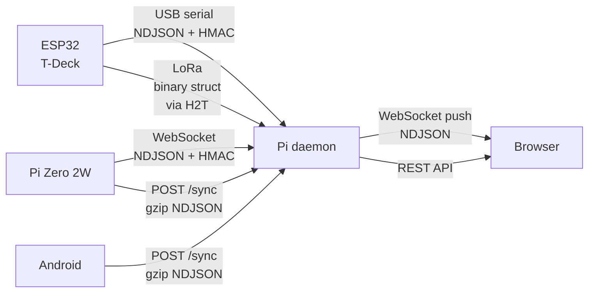

# Wire Protocol Reference

All detection records are HMAC-SHA256 signed newline-delimited JSON (NDJSON). The same format is used over USB serial, WebSocket, and sync POST bodies.

## Record types

### wifi

```json
{
  "v": 1,
  "type": "wifi",
  "node_id": "t-deck-van",
  "run_id": "01J4X9K2MHZVR9GS0000000000",
  "mac": "b4:a5:ef:12:34:56",
  "ssid": "Flock-123456",
  "rssi": -72,
  "channel": 6,
  "freq": 2437,
  "capabilities": "[WPA2-PSK-CCMP-128][RSN-PSK-CCMP-128][ESS]",
  "lat": 40.0012345,
  "lon": -74.0023456,
  "ts": 1748995200,
  "via": "serial",
  "sig": "a1b2c3d4"
}
```

### ble

```json
{
  "v": 1,
  "type": "ble",
  "node_id": "t-deck-van",
  "run_id": "01J4X9K2MHZVR9GS0000000000",
  "mac": "aa:bb:cc:dd:ee:ff",
  "name": "Penguin-1234567890",
  "rssi": -68,
  "mfgrid": 2504,
  "services": "0000fea0-0000-1000-8000-00805f9b34fb",
  "lat": 40.0012345,
  "lon": -74.0023456,
  "ts": 1748995200,
  "via": "serial",
  "sig": "a1b2c3d4"
}
```

### gps

```json
{
  "v": 1,
  "type": "gps",
  "node_id": "t-deck-van",
  "run_id": "01J4X9K2MHZVR9GS0000000000",
  "lat": 40.0012345,
  "lon": -74.0023456,
  "accuracy": 3.1,
  "fix": 3,
  "ts": 1748995200
}
```

GPS records are not signed (no `sig` field) — position data is not secret and signing every GPS update wastes bytes on LoRa.

### gap

```json
{
  "v": 1,
  "type": "gap",
  "node_id": "t-deck-van",
  "run_id": "01J4X9K2MHZVR9GS0000000000",
  "start_ts": 1748995200,
  "end_ts": 1748995207,
  "lat": 40.0012345,
  "lon": -74.0023456,
  "reason": "wifi_sync"
}
```

Gap records mark intervals where a node's scanner was paused. The map renders these as dashed segments on the GPS track. `reason` values: `wifi_sync`, `reboot`, `power_loss`.

### info

```json
{
  "v": 1,
  "type": "info",
  "node_id": "t-deck-van",
  "fw": "0.4.0",
  "msg": "online",
  "ts": 1748995200
}
```

## Field reference

| Field | Type | Description |
|---|---|---|
| `v` | int | Protocol version. Current: `1`. |
| `type` | string | Record type: `wifi`, `ble`, `gps`, `gap`, `info` |
| `node_id` | string | Stable node name from config (`t-deck-van`, `pi-pelican`) |
| `run_id` | string | ULID generated at scan-start. Groups one wardrive session. |
| `mac` | string | MAC address, lowercase colon-separated |
| `rssi` | int | Signal strength in dBm |
| `ts` | int64 | Unix timestamp (seconds). Source: GPS time or system clock. |
| `via` | string | Transport path: `serial`, `websocket`, `lora_mesh`, `sync_post` |
| `lat` / `lon` | float64 | WGS84 decimal degrees. Omitted if no GPS fix. |
| `sig` | string | 4-byte HMAC-SHA256 truncated, hex-encoded (8 chars) |

## HMAC signing

The signature covers the serialised JSON object with the `sig` field absent and no trailing newline:

```
signed_bytes = '{"v":1,"type":"wifi","node_id":"t-deck-van",...,"ts":1748995200}'
sig = HMAC-SHA256(key, signed_bytes)[0:4]  // first 4 bytes = 8 hex chars
```

Verification (Go):

```go
func Verify(line []byte, key []byte) bool {
    // strip ,"sig":"xxxxxxxx"} from end, re-close brace
    idx := bytes.LastIndex(line, []byte(`,"sig":"`))
    if idx < 0 { return false }
    payload := append(line[:idx], '}')
    mac := hmac.New(sha256.New, key)
    mac.Write(payload)
    expected := hex.EncodeToString(mac.Sum(nil)[:4])
    actual := string(line[idx+9 : idx+17])
    return hmac.Equal([]byte(expected), []byte(actual))
}
```

## LoRa binary format (T-Deck → Pi via H2T)

Over LoRa, full JSON is too verbose. Binary structs are used instead, wrapped in a Meshtastic `MeshPacket` with `portnum = PRIVATE_APP` (256).


The daemon converts binary LoRa records to full NDJSON records with `via:"lora_mesh"` before storing.

## Sync POST body

`POST /api/v1/sync` accepts a gzip-compressed stream of NDJSON records — one per line, all types accepted. The daemon processes records idempotently; re-uploading already-seen records (same `mac` + `run_id`) is a no-op.

```
Content-Type: application/x-ndjson
Content-Encoding: gzip
X-Node-ID: t-deck-van
X-Last-Seq: 0   // 0 = full upload; >0 = incremental from that sequence number
```

Response:
```json
{"accepted": 47, "skipped": 3, "last_seq": 1748995247}
```

`last_seq` is stored by the sending node and used as `X-Last-Seq` on the next sync.

## Transport summary


