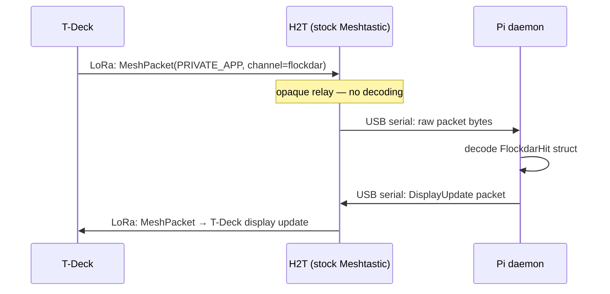

# Setup: T-Deck Field Scanner (Platform C)

T-Deck running flockdar firmware. Communicates with the Pelican Hub exclusively over LoRa.

## Prerequisites

```
Hardware:   LILYGO T-Deck or T-Deck Plus with microSD card
Dev tools:  Go toolchain, task, PlatformIO (pip install platformio)
H2T:        Configured with flockdar Meshtastic channel (see pelican-hub.md step 4)
```

## 1. Configure firmware

Edit `esp32/src/config.h` (or create `esp32/flockdar_local.h` for overrides):

```cpp
// Node identity
#define FD_NODE_ID      "t-deck-van"

// LoRa / Meshtastic channel
#define FD_LORA_CHANNEL "flockdar"
#define FD_LORA_KEY     "your-32-byte-hex-key-here"  // same key as H2T
#define FD_LORA_REGION  LORA_REGION_US915

// HMAC key for NDJSON signing (must match daemon config)
#define FD_HMAC_KEY     "your-hmac-key-here"

// Features
#define FD_ENABLE_GPS   1   // T-Deck Plus has built-in GPS
#define FD_ENABLE_SD    1
#define FD_ENABLE_LORA  1
#define FD_ENABLE_OLED  1
```

## 2. Build and flash

```bash
# Build T-Deck firmware (also regenerates oui_list.h from signatures.toml)
task firmware:build

# Flash (T-Deck must be in boot mode: hold trackball, press reset)
task firmware:flash

# Monitor serial output
task firmware:monitor
```

## 3. SD card setup

Format microSD as FAT32. Create `/flockdar/` directory. The firmware creates log files automatically, but you can pre-populate:

```bash
# Optional: pre-populate trusted nets (for Pi Zero 2W nodes — not used by T-Deck)
# T-Deck communicates via LoRa only, no WiFi sync
```

Insert SD card into T-Deck before powering on.

## 4. First boot

```
Boot screen:
  flockdar v0.4.0
  node: t-deck-van
  run:  Wandering Magpie #1
  
  GPS: acquiring...
  LoRa: scanning for hub...

After GPS fix (~60s outdoors):
  GPS: fix ✓ (3D, 4 sats)
  LoRa: hub seen ✓ (pi-pelican, -82 dBm)
  WiFi: scanning ch 1/6/11...

Normal operation:
  (◕‿◕)  ← bored face, no hits yet
  run: Wandering Magpie #1
  hits: 0 (0 new)  nodes: 2
```

## 5. Button shortcuts

| Button | Action |
|---|---|
| `S` | Toggle stats overlay |
| `R` | Start new run (new ULID, new run name) |
| `C` | Force heartbeat / ping hub |
| `M` | Toggle map mode (future) |

## LoRa pairing with H2T

The T-Deck and H2T must share the same channel name and PSK key. The T-Deck firmware encodes outbound packets as Meshtastic `PRIVATE_APP` messages — the H2T relays them to the Pi daemon without needing to understand the content.



## Mood states

| Face | Meaning | Trigger |
|---|---|---|
| `(◕‿◕)` | bored | No hits in last 5 min |
| `(•‿•)` | normal | Scanning, occasional hits |
| `(^‿^)` | happy | New hit detected |
| `(★‿★)` | excited | Cluster of hits (3+ in 60s) |
| `(-_-)` | sleepy | Battery < 20% |
| `(✿‿✿)` | sync | LoRa heartbeat confirmed by hub |

"I remember you" reaction: if a detected MAC was seen in a previous run, display briefly shows `(ಠ_ಠ)` before returning to current mood.

## SD card data retrieval

The SD card is the authoritative loot record. LoRa transmission is best-effort.

**Option 1: Physical swap**
Power off T-Deck, remove SD, mount on computer, copy `/flockdar/*.ndjson` logs.

**Option 2: Import via daemon**
```bash
# Mount SD on Pi
task firmware:sd-import SD=/media/pi/FLOCKDAR TARGET=pi-pelican.local
# (future: task sd:import)
```

**Option 3: USB serial import**
```bash
# Connect T-Deck via USB while in monitor mode
task dev PORT=/dev/ttyUSB1
```

## Troubleshooting

**No GPS fix:**
- T-Deck Plus: check which GPS module is installed (L76K vs u-blox M10)
- Firmware auto-detects, but needs clear sky for initial cold fix (~60s)
- Serial monitor shows GPS NMEA sentences if module is responding

**LoRa not connecting to hub:**
- Verify channel name and key match exactly in T-Deck config and H2T Meshtastic app
- Check region (US = 915MHz, EU = 868MHz) — must match on both ends
- `task firmware:monitor` → look for `lora: tx ok` / `lora: rx timeout`
- T-Deck SX1276 and H2T SX1262 are interoperable at the same frequency and spreading factor

**WiFi not scanning:**
- Verify `FD_ENABLE_SD = 1` (SD card must be present for logging)
- Serial monitor: `wifi: promiscuous mode active` should appear on boot
